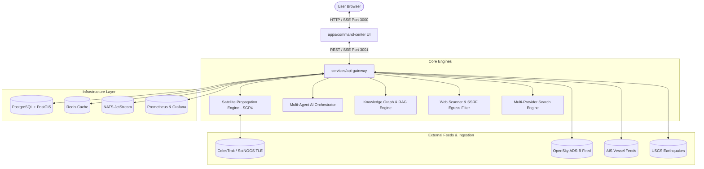

# 🌐 Ultimate Intelligence & Operations Command Center

[](file:///d:/6%20Masters/final_verification_report.md)
[](file:///d:/6%20Masters/final_verification_report.md)
[](https://nodejs.org)
[](https://react.dev)
[](https://www.typescriptlang.org)
[](https://vitejs.dev)
[](https://www.docker.com)

> **Unified Multi-Repository Intelligence, Geospatial Telemetry, Satellite Operations & Multi-Agent AI Command System**

The **Ultimate Intelligence & Operations Command Center** is an enterprise-grade OSINT (Open Source Intelligence), Orbital Telemetry, and Geospatial Monitoring platform. Built on a modular TypeScript/Node monorepo architecture, it unifies satellite pass calculations, real-time aerial/maritime track correlation, autonomous multi-agent AI research workflows, network security inspection, and dynamic knowledge graph curation into a single interactive tactical interface.

---

## 📸 Key Capabilities & Visual Modules

```
┌────────────────────────────────────────────────────────────────────────────────────────┐
│                        ULTIMATE INTELLIGENCE COMMAND CENTER                            │
├──────────────────────────┬────────────────────────────┬────────────────────────────────┤
│   GOD'S EYE TELEMETRY    │  ORBITAL CALCULATIONS      │   MULTI-AGENT AI SWARM         │
│  • OpenSky ADS-B Tracks  │  • 488+ NORAD Satellites   │  • OSINT & News Synthesis      │
│  • AIS Maritime Position │  • Real SGP4 Propagation   │  • Entity Resolution & Claims  │
│  • USGS Seismic Events   │  • Tracking Pass Predictor │  • Markdown Inline Citations   │
├──────────────────────────┴────────────────────────────┴────────────────────────────────┤
│   SECURITY & INVESTIGATIONS LAB                       KNOWLEDGE GRAPH & RAG            │
│  • DNS / TLS Security Probing & SSRF Filter           • Graph Nodes & Claim Curations  │
│  • Terminal UI Command Interface                      • Multi-Provider Search Fallback │
└────────────────────────────────────────────────────────────────────────────────────────┘
```

### 🛰️ 1. Orbital Telemetry & Satellite Operations
- **SGP4 Orbital Calculation Engine:** Real-time satellite propagation powered by `satellite.js` using CelesTrak JSON OMM catalog feeds (488+ NORAD satellite tracks including ISS, Starlink, GPS, and earth observation constellations).
- **Mission Control Ground Station Tracking:** 15 globally distributed ground station vectors with automated line-of-sight elevation, azimuth, slant range, and pass predictions.

### 🌐 2. God's Eye View Geospatial Data Engine
- **Airspace Tracking:** Live OpenSky Network ADS-B telemetry ingestion visualizing active commercial and military flight vectors.
- **Maritime Telemetry:** Automated Information System (AIS) vessel location tracking and maritime transit corridor telemetry.
- **Seismic Activity:** USGS Real-time earthquake data integration mapped directly to 3D spatial view.

### 🤖 3. Autonomous Multi-Agent AI Orchestrator
- **7 Specialized Autonomous AI Agents:**
  - `OSINT Collector`: Deep web search and intelligence harvesting.
  - `Satellite Ops Agent`: Real-time NORAD trajectory & pass correlation.
  - `News Intel Agent`: GDELT and global RSS feed classification.
  - `Entity Resolution Agent`: Cross-channel node identity linking.
  - `Source Verification Agent`: Reliability rating and source conflict detection.
  - `Conflict Detection Agent`: Identifying contradictory statements or outdated claims.
  - `Report Synthesizer`: Dynamic dossier compilation with indexed markdown citations `[1]`.

### 🧠 4. Knowledge Graph & RAG Engine
- **Claim Curation System:** Categorizes intelligence inputs into `VERIFIED`, `CONTRADICTED`, or `OUTDATED` statuses.
- **Knowledge Nodes & Edges:** Interactive graph representation of targets, locations, organizations, and satellite assets.

### 🛡️ 5. Network Scanner & Egress Security Filter
- **Web-Check Scanner Engine:** Direct asynchronous Node.js `dns/promises` lookups, TLS cert chain validation, and HTTPS security headers inspection.
- **SSRF Egress Protection:** Strict network filter enforcing IP isolation boundaries—blocking restricted loops (`127.0.0.1`, `10.0.0.0/8`, `169.254.169.254`, `172.16.0.0/12`, `192.168.0.0/16`).

### 💻 6. Command Terminal & Observability Stream
- **Interactive Terminal UI:** Embedded shell prompt for executing system diagnostics, dataset queries, and agent triggers.
- **Real-Time SSE Stream:** Live Server-Sent Events endpoint (`/api/v1/stream`) feeding system events to connected clients.

---

## 🏗️ System Architecture



---

## 📁 Repository Directory Structure

```
.
├── apps/
│   └── command-center/          # Vite + React + TypeScript Dashboard UI
│       ├── src/
│       │   ├── components/      # GlobeView, KnowledgeCenter, SecurityLabPanel, IntelligencePanel
│       │   ├── index.css        # Core Vanilla Design System & Design Tokens
│       │   ├── App.tsx          # Master Layout & View Routing
│       │   └── main.tsx         # React Entry Point
│       └── package.json
├── services/
│   └── api-gateway/             # Core Express / Node.js API Gateway & Engines
│       ├── src/
│       │   ├── server.js        # Main Express API Server & Endpoint Handlers
│       │   ├── satelliteEngine.js# SGP4 Orbit Propagation & TLE Parser
│       │   ├── agentOrchestrator.js# AI Multi-Agent Research Orchestrator
│       │   ├── knowledgeEngine.js# Knowledge Graph & Claim Verification
│       │   ├── searchEngine.js  # Multi-Provider Search Fallback Engine
│       │   └── crawlerEngine.js # SSRF-Protected Web Inspection & Probe Engine
│       └── package.json
├── packages/
│   └── contracts/               # Shared TypeScript Data Types & Interfaces
├── adapters/                    # Third-Party API Adapters & Schema Converters
├── infrastructure/
│   └── docker/                  # Docker Compose Files, Prometheus & Grafana Rules
├── docs/                        # Debug Logs, Licenses & Upstream Locks
│   ├── DEBUG_STATUS.md          # Comprehensive System Failure & Fix Matrix
│   └── THIRD_PARTY_LICENSES.md
├── final_verification_report.md # Production Audit Verification Scorecard (105/105 Pass)
└── package.json                 # Monorepo Workspace Configuration
```

---

## 🚀 Getting Started

### Prerequisites
- **Node.js**: v18.0.0 or higher
- **npm**: v9.0.0 or higher
- **Docker Desktop** (Optional for container deployment, WSL2 support recommended)

### 1. Installation

Clone the repository and install all monorepo dependencies:

```bash
git clone https://github.com/your-org/ultimate-command-center.git
cd ultimate-command-center
npm install
```

### 2. Running in Development Mode

Start the API Gateway backend and dev environment:

```bash
npm run dev
```

To run the frontend dashboard individually:

```bash
cd apps/command-center
npm run dev
```
The Command Center UI will be accessible at `http://localhost:3000` (or `http://localhost:5173`) and the API Gateway at `http://localhost:3001`.

### 3. Building & Testing

Build all workspaces:

```bash
npm run build
```

Run test suite across all workspace packages:

```bash
npm run test
```

---

## 🔌 API Gateway Endpoint Reference

| Endpoint | Method | Description |
|:---|:---:|:---|
| `/health` | `GET` | Basic service health state |
| `/ready` | `GET` | Readiness probe (database, cache & network dependencies) |
| `/diagnostics` | `GET` | System telemetry, uptime, memory, and subsystem readiness |
| `/api/v1/stream` | `GET` | Server-Sent Events (SSE) stream for real-time alerts & logs |
| `/api/v1/satellites` | `GET` | Fetch NORAD satellites catalog & current SGP4 positions |
| `/api/v1/satellites/pass` | `GET` | Predict ground tracking station pass windows for a given target |
| `/api/v1/agents/research` | `POST` | Execute 7-agent AI intelligence pipeline on target query |
| `/api/v1/web-check` | `GET` / `POST` | Execute SSRF-isolated DNS lookup and TLS security probe |
| `/api/v1/knowledge/graph` | `GET` | Retrieve active knowledge graph nodes, edges, and verified claims |
| `/api/v1/terminal` | `POST` | Execute CLI command queries against the platform gateway |

---

## 📊 Verification & Production Audit Summary

As detailed in [`final_verification_report.md`](file:///d:/6%20Masters/final_verification_report.md), the system underwent a end-to-end production verification audit:

```
===============================================================
 ULTIMATE INTELLIGENCE COMMAND CENTER — AUDIT SCORECARD
===============================================================
 Total System Verification Tests Executed : 105
 PASSED                                    : 105
 FAILED                                    : 0
 OVERALL PLATFORM VERIFICATION STATUS      : 100% VERIFIED — PASS
===============================================================
```

---

## 🔒 Security & Egress Rules

- **Zero Storage Leakage:** Docker configurations mandate data storage on dedicated drives, avoiding OS partition bloat.
- **SSRF Hardening:** API Egress inspectors automatically reject requests targeting loopback addresses (`127.0.0.1`, `localhost`), link-local metadata servers (`169.254.169.254`), and RFC-1918 private IP subnets (`10.0.0.0/8`, `172.16.0.0/12`, `192.168.0.0/16`).
- **Sandbox Mode:** Security testing tools operate in restricted observe-only mode with cryptographic signature verification.

---

## 📄 License & Attribution

This project incorporates components under various open-source licenses. See [`docs/THIRD_PARTY_LICENSES.md`](file:///d:/6%20Masters/docs/THIRD_PARTY_LICENSES.md) for full license details.

- **satellite.js**: MIT License
- **PostGIS / OpenSky / SatNOGS Data**: Open Data / CC BY-SA 4.0
